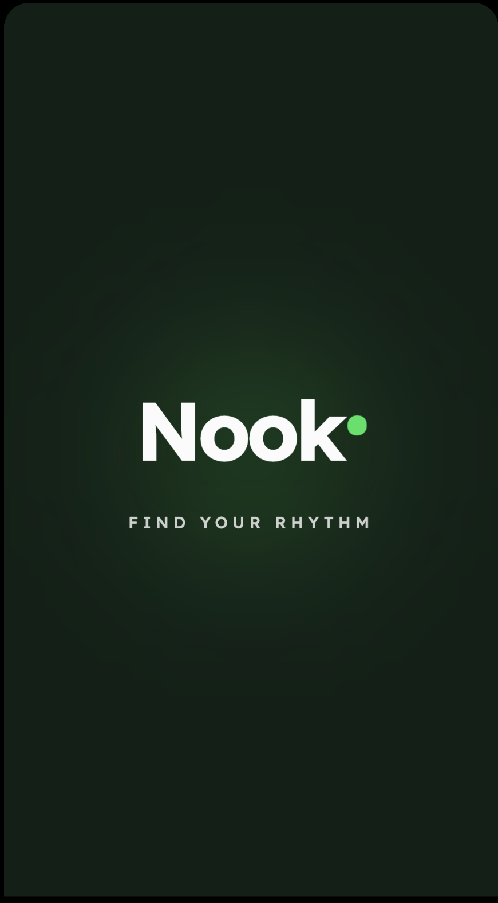
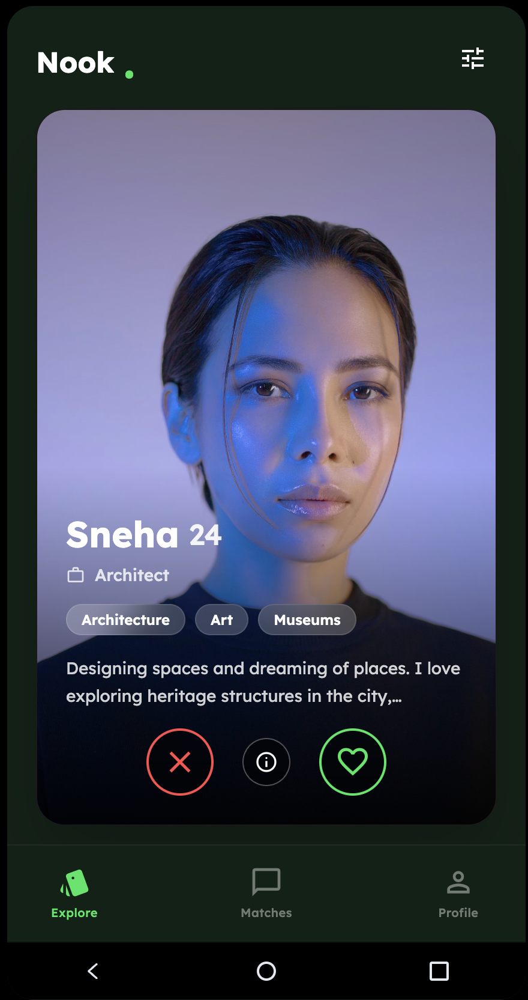
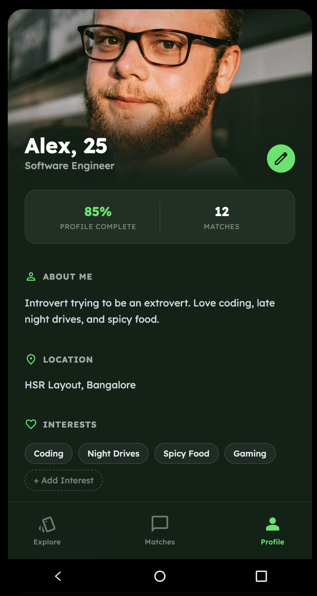
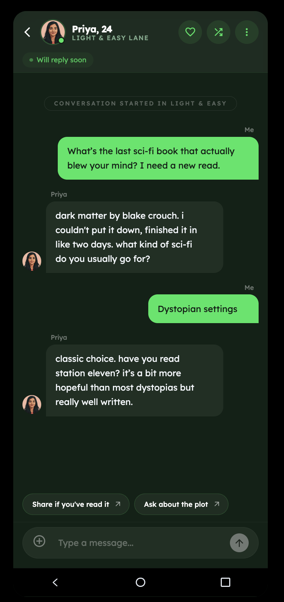

# Nook - Dating App for Introverts

## Links
* **Live Demo:** https://ais-dev-kp6m5ngp5mc2xcqpg2kax7-752778455529.asia-southeast1.run.app
* **Demo Video:** https://www.loom.com/share/1598ca0e423948a3b761d31643336f7c

## Context
In the fast-paced landscape of modern dating and social networking apps, the emphasis is often placed on rapid swiping and immediate, witty banter. While this works for some, it leaves a significant demographic underserved: introverts and individuals who experience social anxiety. For these users, the pressure of initiating and sustaining an engaging conversation with a stranger can be a massive barrier to forming meaningful connections.

## Problem Statement
The "blank canvas" of a new chat window is intimidating. Users frequently struggle with breaking the ice, reading the room, or knowing how to transition a conversation from small talk to deeper topics. Existing social apps provide the match but offer no scaffolding for the actual interaction, leading to abandoned chats, ghosting, and user burnout.

## Solution
Nook is an AI-powered social application designed to lower the barrier to entry for digital communication. Instead of throwing users into an unstructured chat, Nook introduces the concept of **"Guided Chat Lanes."**

When a match is made, users can select a conversational "Lane" (such as *Light & Easy* or *Deep Dive*). Powered by the Gemini AI API, the app acts as a supportive co-pilot, providing contextual, non-intrusive conversation starters and real-time guidance tailored to the chosen lane's vibe. By offering a structured, low-pressure environment, Nook empowers introverted users to navigate the early stages of a conversation authentically and confidently, transforming anxiety into genuine connection.

## Key Features
*   **AI-Assisted Icebreakers:** Context-aware opening messages generated by Gemini to match the user's comfort level.
*   **Dynamic Chat Lanes:** Selectable conversation modes that set the tone and expectations for both users.
*   **Mobile-First UX:** A sleek, dark-mode optimized interface designed to feel safe, intimate, and accessible.

## Screenshots

| Splash | Explore | Profile |
|--------|---------|---------|
|  |  |  |

| Chat Lanes | Active Chat | Conversation |
|------------|-------------|--------------|
|  |  |  |

## Tech Stack
*   **Frontend:** React 19, Tailwind CSS, Vite
*   **AI Integration:** Google Gemini API (`gemini-3.1-pro-preview` model)
*   **Language:** TypeScript

## How to Run Locally
1. Clone the repository.
2. Install dependencies:
   ```bash
   npm install
   ```
3. Create a `.env.local` file in the root directory and add your Gemini API key:
   ```env
   GEMINI_API_KEY=your_api_key_here
   ```
4. Start the development server:
   ```bash
   npm run dev
   ```
